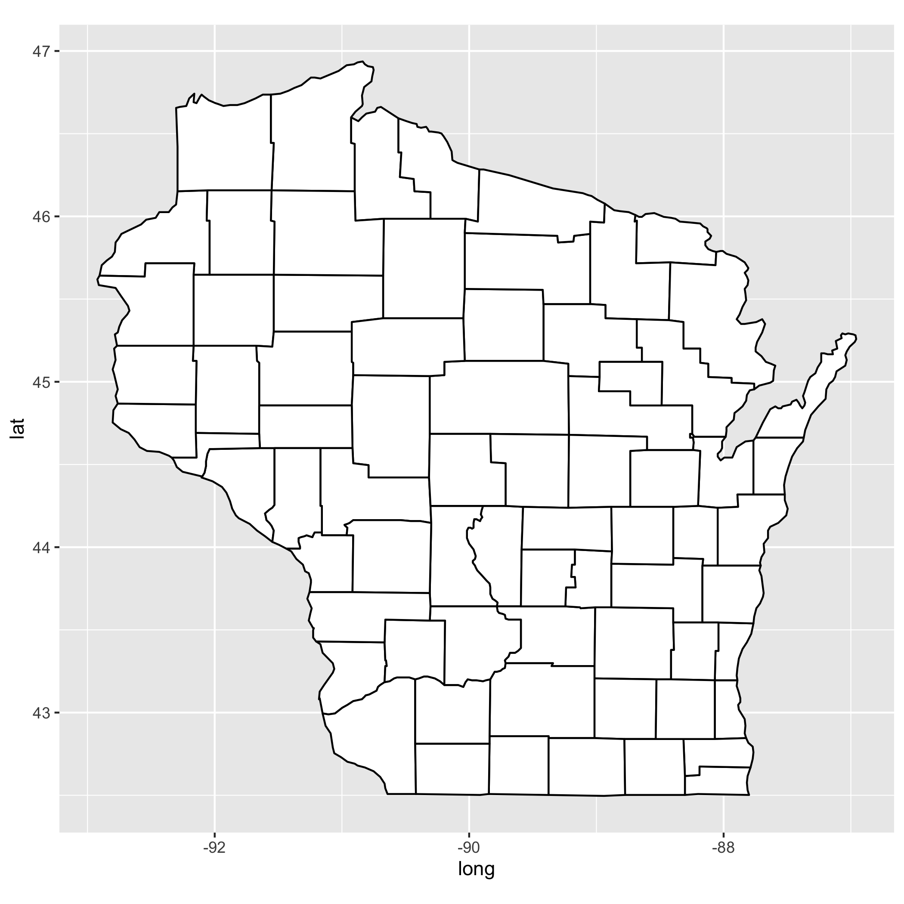
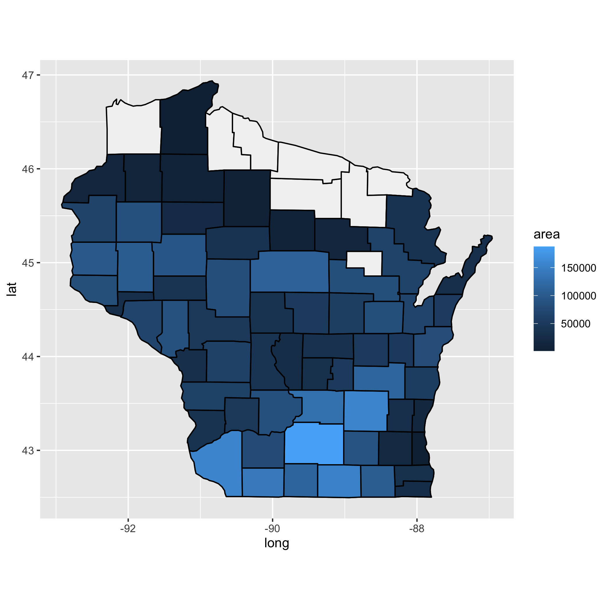
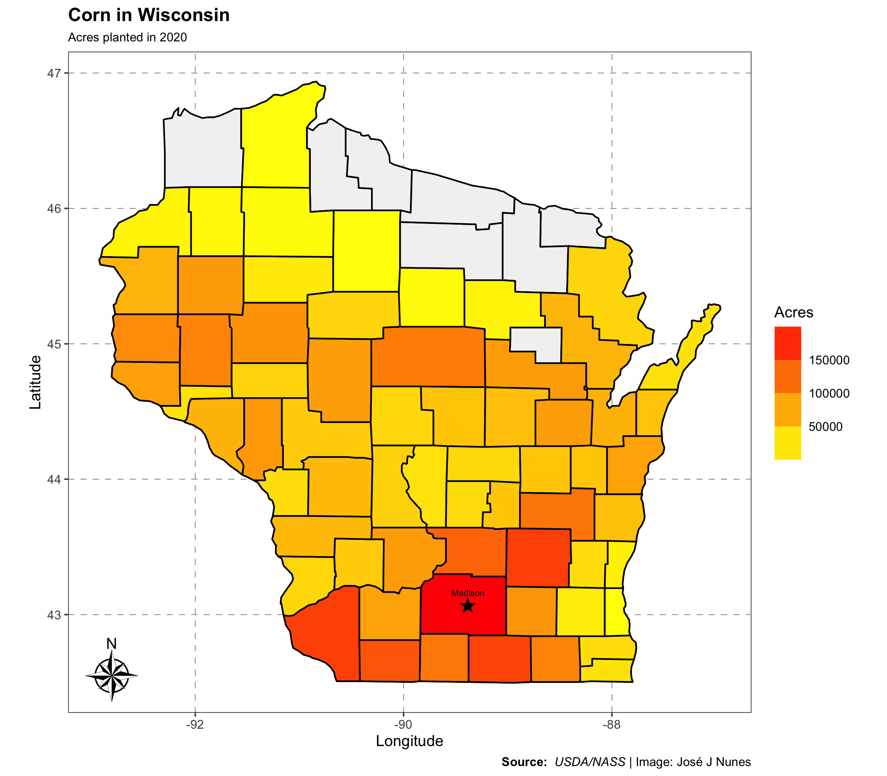

Data visualization is just awesome! And it's incredible how versatile the package `ggplot2` is. To show you that, we're going to build a map of Wisconsin containing a gradient of colors indicating the area planted with corn in the state at a county level. To do so, we'll be using the package 'tidyverse' for plotting and data manipulation. And the packages `ggspatial`, `ggthemes`, and `ggtext` for customizing our map. 

```{r, warning = FALSE, message = FALSE}
library(tidyverse) #ggplot2 for plotting and dplyr for data manipulation
library(ggspatial) #map features
library(ggthemes)  #map features
library(ggtext)    #map features
```


As our first step, we need Wisconsin geographic coordinates (latitude and longitude) that will work as our base map. One easy way to get this information is using the `ggplot2` package. That's right. You heard me `ggplot2`! `ggplot2` is not only for plotting graphics but also maps and other cool stuff. In this case, `ggplot2` carries the 'map_data' function, which loads geographical data from the `maps` package. 

To get the state of Wisconsin data, we just need two lines of code. On the first line, we specify the division of our data in the 'map_data' function. When we use 'county', the output will be Wisconsin with all its counties coordinates. And if we use 'state', it will be only the state geographical data, which would result in a blank map. On the second line, we filter the state we'd like to work with, in this case, Wisconsin. But, you can choose your own state. If we don't filter by state, the output will be the United States data.


```{r}
wisconsin <- map_data("county") %>% #to specify the division of the data
  filter(region == "wisconsin")     #to filter by state
```


Let's take a look at what kind of data we got. As you can see, we have everything we need for our map. We have longitude (long) and latitude (lat) for all Wisconsin counties (subregion) and also each county group.

```r
library(DT)
wisconsin %>% 
  datatable()
```

```{r echo=TRUE, include = FALSE}
library(htmlwidgets)
library(htmltools)
library(DT)
df <- wisconsin %>% 
  DT::datatable()

htmlwidgets::saveWidget(df, file = "wisconsin.html", selfcontained = TRUE)
```

<iframe seamless src="wisconsin.html" width="100%" height="500"></iframe>

The data are looking good, but the subregion column is not intuitive. So, let's change its name to county using the 'rename' function from 'dplyr'.

```{r}
wisconsin <- map_data("county") %>% #to specify the division of the data
  filter(region == "wisconsin") %>% #to filter by state
  rename("County" = "subregion")    # to rename subregion to county
```


Now, that's much better!

```{r echo=TRUE, include = FALSE}
library(htmlwidgets)
library(htmltools)
library(DT)
df1 <- wisconsin %>% 
  DT::datatable()

htmlwidgets::saveWidget(df1, file = "wisconsin1.html", selfcontained = TRUE)
```

```r
wisconsin %>% 
  datatable()
```


<iframe seamless src="wisconsin.html" width="100%" height="500"></iframe>

As our first example, let's create a basic map of the state using the 'wisconsin' data set with `ggplot2`. The structure of a map in `ggplot2` is the same as any other plot. We need a data frame, the aesthetics, and a geom.


```{r fig.align='center', include=FALSE}
#something wrong - not showing output
map0 <- ggplot(data = wisconsin,       #our data frame 
       mapping = aes(x = long, #longitude
                     y = lat,  #latitude
                     group = group)) + #the groups within a county
  geom_polygon(color="black", fill="white") + #geom that draws the map
  coord_fixed(1.3) #to keep a fixed ratio between coordinates so the map don't get twisted 
```




Now that we have our base map figured out, we have to add some data into it. We're going to use the data from the [USDA/NASS Quick Stats website](https://quickstats.nass.usda.gov/). There you can choose the kind of data you'd like to use and download the spreadsheet. For our example, we filtered the area planted with corn in Wisconsin at a county level in 2020. Another way of downloading the USDA/NASS data is using the [`tidyUSDA` package](https://github.com/bradlindblad/tidyUSDA/). However, since there are some pretty specific instructions to use the package, we'll leave that for another time and use our csv spreadsheet.


```{r, message=FALSE, warning=FALSE}
url <- "https://raw.githubusercontent.com/JoseJNunes/Wisconsin_Map/main/corn_data.csv"
usda_corn <- read_csv(url)
```


As seen below, there's a lot of information in our data set. But don't worry, we're only going to need the columns 'County' and 'Value'. Here 'Value' is the area in acres planted with corn in each county. 

```{r echo=TRUE, include = FALSE}
library(htmlwidgets)
library(htmltools)
library(DT)
corn <- usda_corn %>% 
  DT::datatable()

htmlwidgets::saveWidget(corn, file = "usda_corn.html", selfcontained = TRUE)
```


<iframe seamless src="usda_corn.html" width="100%" height="500"></iframe>


To select the columns that we'll need, we use the 'select' function from `dplyr`. Once we have our two columns, we should adjust some details in them. The first one is to rename 'Value' to 'area' to be more intuitive. The second one is to change the county names from upper to lowercase using the 'mutate_all' function to match the 'wisconsin' data frame that have the county names in lowercase. Now, all we have to do is join the two data frames using the 'left_join' function also from `dplyr`, by 'County'.  


```{r}
corn_data <- usda_corn %>% 
  select("County", "Value") %>%       #to select the columns that we need
  rename("area" = "Value") %>%        #to rename the Value column to area
  mutate_all(list (tolower)) %>%      #to change from UPPER to lowercase the county names
  left_join(wisconsin, by = "County") #to join both data frames using County as a reference
```


Now we have a single data frame ('corn_data') with the geographical information of the state of Wisconsin and the area planted with corn in 64 of its counties.

```{r}
corn_data
```


Before we dive into our final map, let's make the last adjustment to our data frame. If we look at the structure of our variables, we can see that 'area' is treated as a character. However, for our map to work, we need it as numeric data.


```{r}
str(corn_data)
```

```{r}
corn_data$area <- as.numeric(corn_data$area)
str(corn_data)
```


Now we're good to go!

The final step is to build the map. We'll use our first map example as our base. But, now we'll add another 'geom_polygon' to it with the data that we just created by joining the 'wisconsin' and 'usda_corn' data. The trick behind the other 'geom_polygon' with the 'corn_data' is to add 'fill = area' inside the aesthetics. When we set it that way, 'ggplot2' understands you want something more of it and doesn't just fill with a single color. Instead, it uses the area value from each county to create a gradient of colors that goes from the smallest to the largest area planted with corn in the state. 

 
```{r}
map1 <- ggplot(data = wisconsin, 
       mapping = aes(x = long, 
                     y = lat, 
                     group = group)) + 
  geom_polygon(color = "black", fill = "gray95") +
  coord_fixed(1.3) +
  geom_polygon(data = corn_data, #the data that we joined
               aes(fill = area), #we use 'fill = area' inside the aes to get the different colors
               color = "black") 
```





And there you have it! A map of Wisconsin with a gradient of colors indicating the number of acres planted with corn in the state in 2020. But, let's make it prettier. Like change its colors, add titles, add a north star arrow, and the location of the beautiful capital Madison to the map.


```{r map, message=FALSE, warning=FALSE}
#to add Madison's location in the map
madison <- data.frame(location = c("Madison"), long = c(-89.38), lat = c(43.07)) 

map_wi <- ggplot(data = wisconsin, 
       mapping = aes(x = long, 
                     y = lat, 
                     group = group)) + 
  geom_polygon(color = "black", 
               fill = "gray95") +
  coord_fixed(1.3) +
  geom_polygon(data = corn_data, 
               aes(fill = area), 
               color = "black") +
  geom_point(data = madison, 
             aes(x = long,
                 y = lat), #point with Madison's location
             alpha = 0, 
             show.legend = F, 
             inherit.aes = F, 
             color = "black") +
  scale_fill_gradient(low='yellow', high='red') + #to scale the colors between yellow and red
  ggthemes::theme_few(base_size = 10) + #the theme and the base size of the font
  labs(x = "Longitude", y = "Latitude") + #to add the x and y labels
  labs(title = "Corn in Wisconsin",          #title of the map
       subtitle = "Acres planted in 2020",   #subtitle of the map
       caption = "**Source:** *USDA/NASS* | Image: José J Nunes") + #caption of the map
  theme(panel.grid.major = element_line(color = "gray60",    # color of the coordinates lines
                                        linetype = "dashed", #type of the coordinates lines
                                        size = 0.25),        #size of the coordinates lines
        plot.title = element_markdown(face = "bold", hjust = 0), #to edit the title
        plot.subtitle = element_markdown(size = 8),              #to edit the subtitle
        plot.caption = element_markdown()) +                      #to edit the caption
  geom_text(data = madison, aes(x = long, y = lat, label = Madison), #to add the star in the map
            label="★", size=4, family = "HiraKakuPro-W3",
            inherit.aes = F) +
  geom_text(data = madison,aes(x = long, y = lat, label = Madison), #to add "Madison" in the map
            label="Madison", size = 2, 
            inherit.aes = F,
            vjust = -1.5) +
  labs(fill = "Acres")+                                #label of the scale
  guides(fill = guide_colorsteps(show.limits = F))+    #to edit the scale
  ggspatial::annotation_north_arrow(style = north_arrow_nautical)  +#to add the north star arrow
  ggsave("map_wi.png", width = 8, height = 7)
```





And that's our final map! As we can see, a significant part of the corn was planted in the southern part of the state. And Dane County had the largest number of acres in 2020.

If you'd like to learn more about `ggplot2` and maps, there are lots of cool information out there. I'll leave some listed below:

- https://ggplot2.tidyverse.org/
- https://ggplot2-book.org/maps.html 

And of course, if you have any questions don't hesitate to contact us. Thank you!


